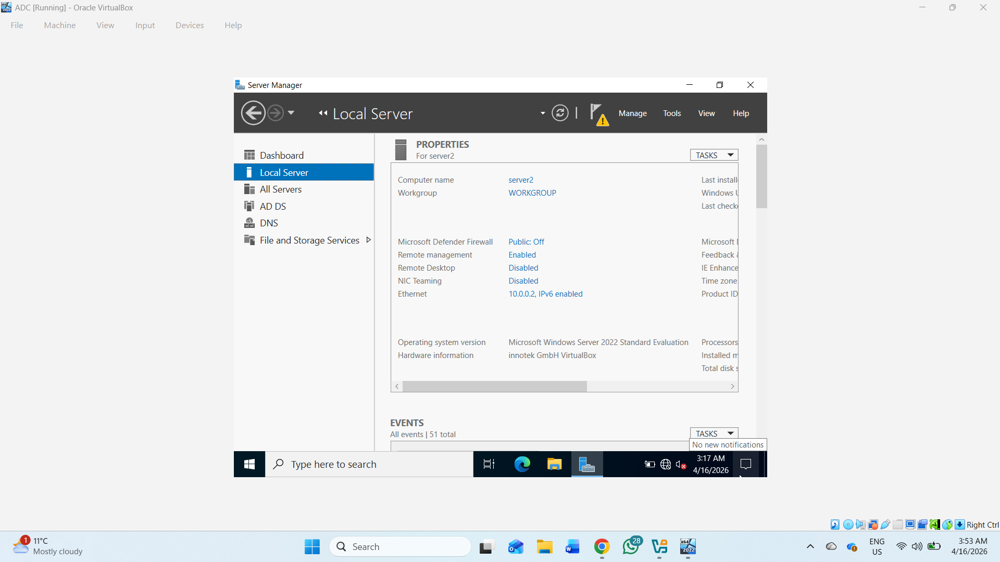
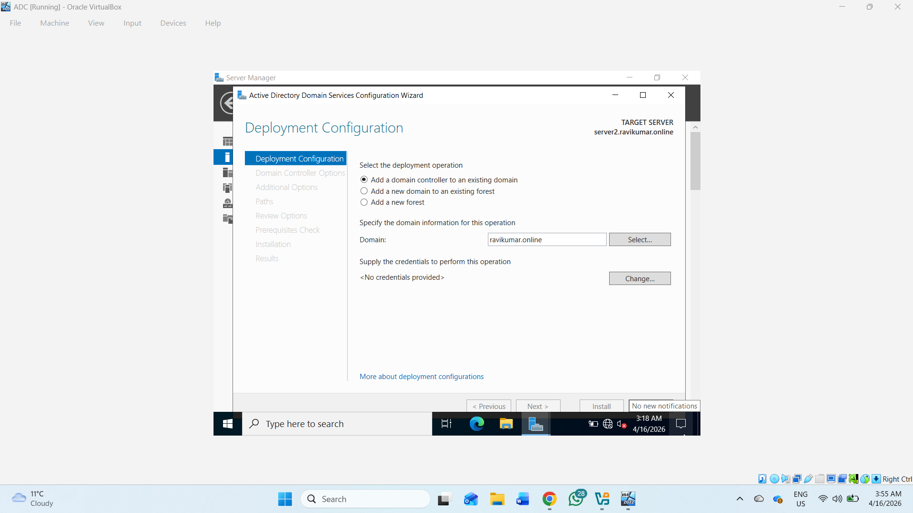
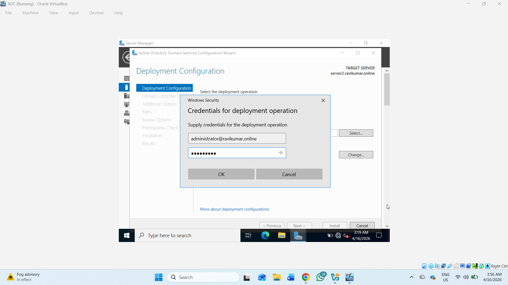
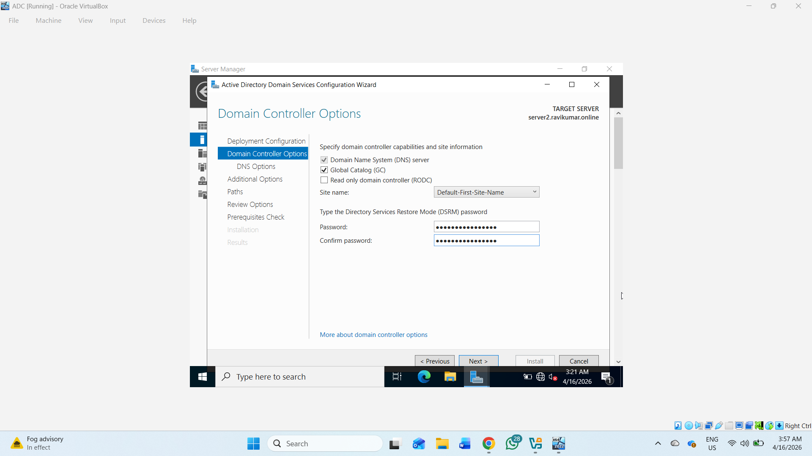
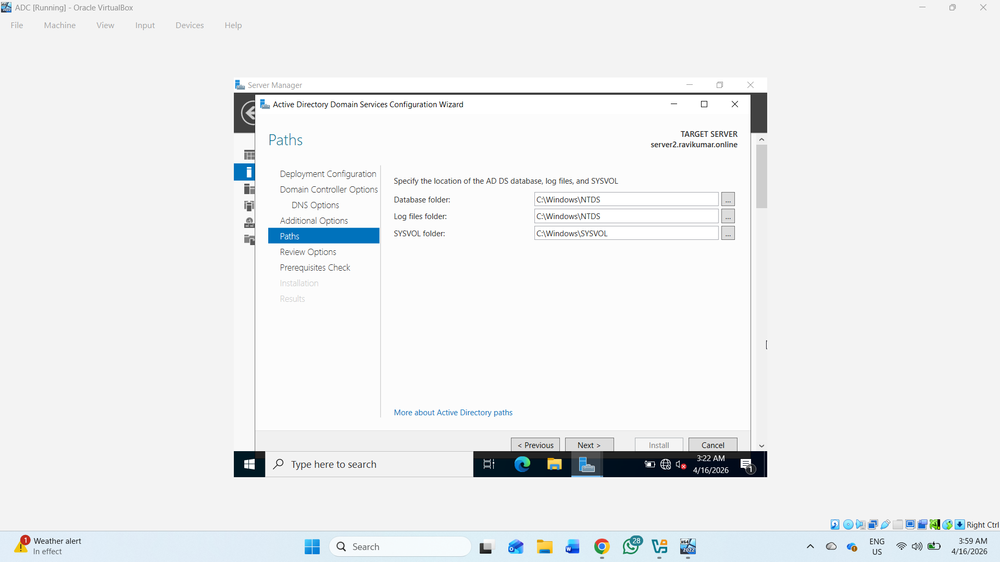
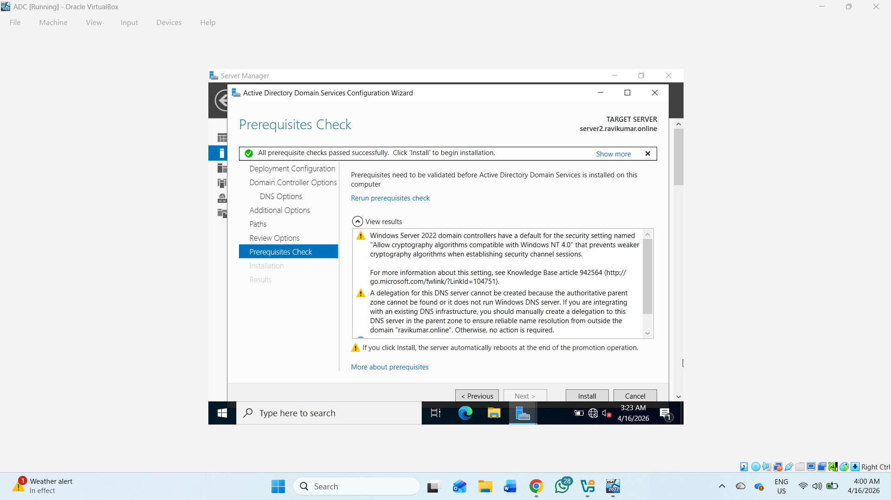
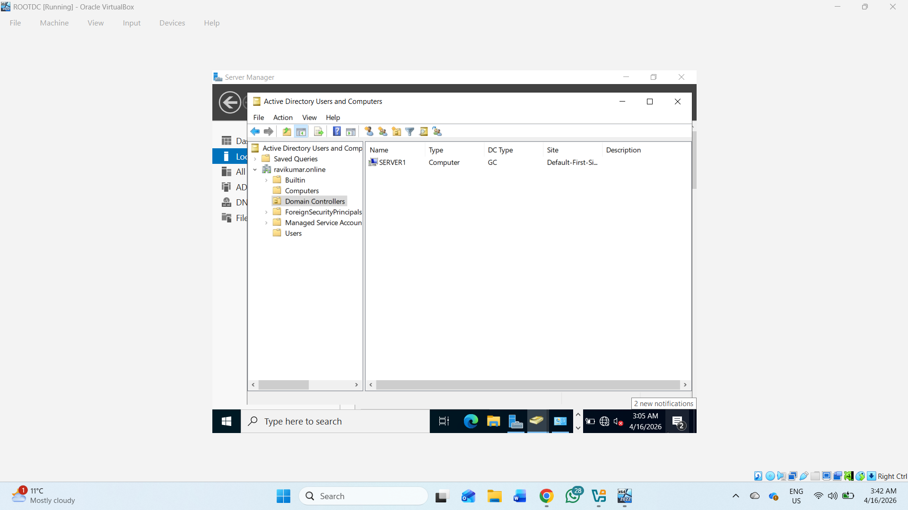
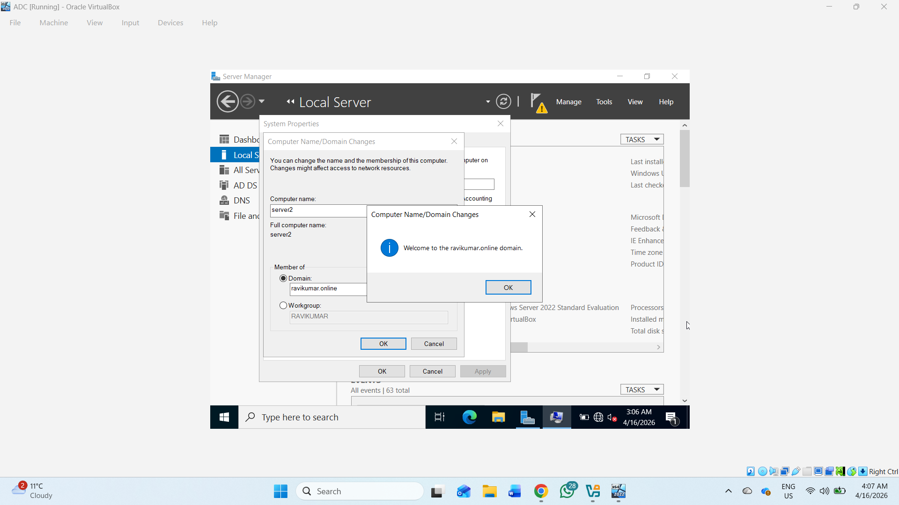
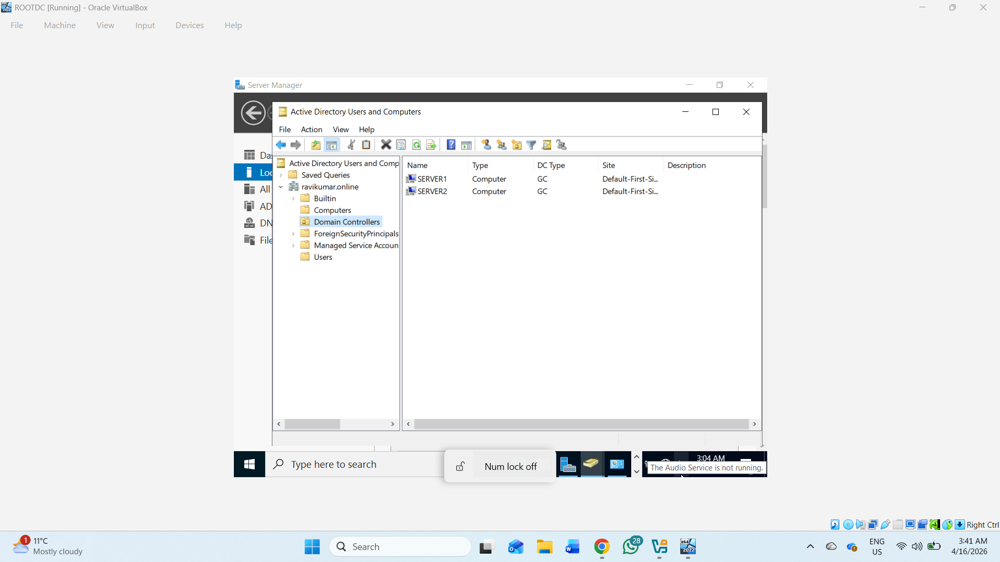

# Active Directory Lab Setup

## 📌 Project Overview

This project demonstrates a complete basic Active Directory Domain Services (AD DS) lab setup using Windows Server and Windows client machines.

The lab includes:

- Active Directory Domain Services (AD DS)


- DHCP Server Configuration


- Domain Join


- Active Directory User Creation


- Additional Domain Controller (ADC)


- Active Directory Replication

---

# 🖥️ Lab Environment

| Device | Role | IP Address |


|---|---|---|


| ROOTDC | Primary Domain Controller | Server1 | 10.0.0.1 |


| ADC | Additional Domain Controller | Server2 | 10.0.0.2 |


| PC1 | Domain Client | DHCP |


| Domain Name | AD Domain | ravikumar.online |


---


# ⚙️ Step 1 — Install Active Directory Domain Services


## On ROOTDC


Open:


```powershell
Server Manager
```

### Install Roles


- Active Directory Domain Services


- DNS Server


### Promote Server to Domain Controller

Select:

```powershell
Add a new forest
```

### Domain Name

```powershell
ravikumar.online
```

Set:
- DSRM Password
- Restart after installation

---

# 🌐 Step 2 — Configure Static IP Address

## ROOTDC Configuration

```powershell


IP Address : 10.0.0.5


Subnet Mask: 255.255.255.0


Gateway    : 10.0.0.1


DNS Server : 10.0.0.5
```

---

# 📡 Step 3 — Configure DHCP Server

## Install DHCP Role

Open:

```powershell
Add Roles and Features
```

Install:


- DHCP Server

---

## Create DHCP Scope

```powershell

Scope Name : LAN_SCOPE


Start IP   : 10.0.0.100


End IP     : 10.0.0.200


Subnet     : 255.255.255.0


Gateway    : 10.0.0.1


DNS Server : 10.0.0.5


Domain Name: ravikumar.online
```

Authorize DHCP after installation.

---

# 💻 Step 4 — Join Client PC to Domain

## Configure DNS on Client

```powershell
DNS Server : 10.0.0.5
```

---

## Join Domain

Open:

```powershell
System Properties > Change Settings > Change
```

Select:
- Domain

Enter:

```powershell
ravikumar.online
```

Provide domain administrator credentials.

Restart PC after successful join.

---

# 👥 Step 5 — Create Active Directory Users

Open:

```powershell
Server Manager > Tools > Active Directory Users and Computers
```

---

## Example Organizational Units

```powershell
HR
IT
Finance
```

---

## Example Users

| Name | Username |
|---|---|
| John Doe | jdoe |
| Alice Wonder | awonder |
| Chris Green | cgreen |

---

# 🏢 Step 6 — Create Additional Domain Controller (ADC)

## Configure ADC Static IP

```powershell
IP Address : 10.0.0.2
Subnet Mask: 255.0.0.0
Gateway    : 10.0.0.1

```

---

## Join ADC to Domain

```powershell
ravikumar.online
```

Restart the server.

---

# 🔄 Step 7 — Promote ADC to Domain Controller

Install:
- Active Directory Domain Services
- DNS Server

Select:

```powershell
Add a domain controller to an existing domain
```



























Domain:

```powershell
ravikumar.online
```

Enable:
- DNS Server
- Global Catalog (GC)

Restart after promotion.

---

# ✅ Step 8 — Verify Replication

## Check Replication Summary

```powershell
repadmin /replsummary
```

---

## Force Replication

```powershell
repadmin /syncall /AdeP
```

---

## Verify Domain Controllers

```powershell
Get-ADDomainController -Filter *
```

Expected:
- ROOTDC
- ADC

---

# 🔍 Step 9 — Verify Client Authentication

Login using domain user:

```powershell
ravikumar\jdoe
```

Verify:
- Domain login works
- DHCP assigns IP
- DNS resolution works
- Replication is successful

---

# 🛠️ Useful Commands

## Check IP Configuration

```powershell
ipconfig /all
```

---

## Verify DNS

```powershell
nslookup ravikumar.online
```

---

## Test Connectivity

```powershell
ping 10.0.0.5
```

---

## Force Group Policy Update

```powershell
gpupdate /force
```

---

# 📚 Features Implemented

- Active Directory Domain Services
- DNS Server
- DHCP Server
- Domain Join
- Active Directory Users
- Additional Domain Controller
- Active Directory Replication
- Centralized Authentication

---

# 📖 Technologies Used

- Windows Server
- Active Directory
- DNS
- DHCP
- PowerShell
- VirtualBox

---

# 👨‍💻 Author

Ravi Kumar

Windows Server & Active Directory Lab Project
